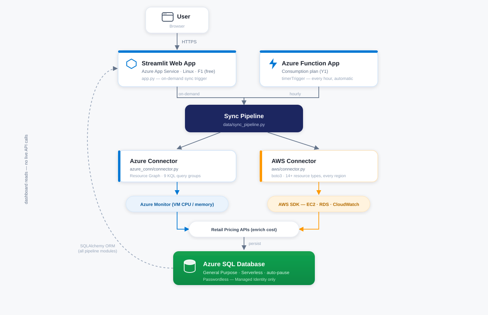
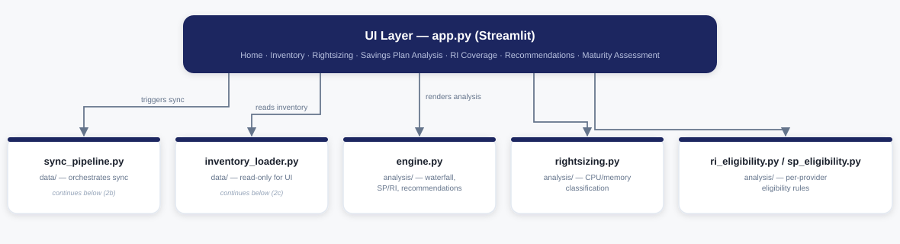
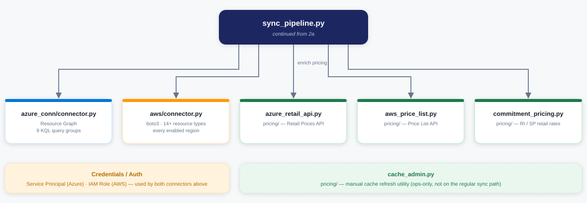
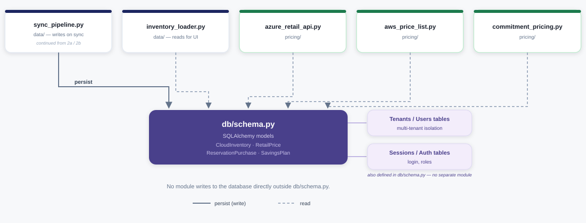
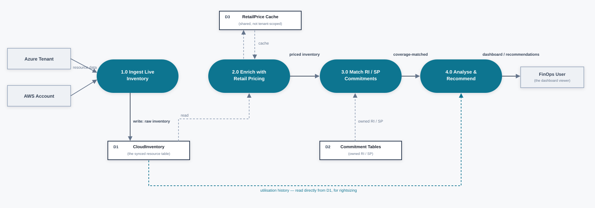
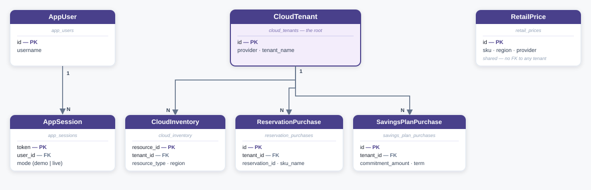

# Multi-Cloud FinOps Optimization System — Architecture Reference

This is the deeper technical reference behind the project [README](README.md) — internal component structure, data flow, and data model, for anyone extending the codebase or defending its design decisions. For "how do I deploy this," see the [README](README.md#deploy) or [docs/DEPLOYMENT.md](docs/DEPLOYMENT.md) instead; this document assumes the system is already running and explains how it's built.

Every diagram and claim below is verified directly against the current codebase, not aspirational — if a design element here doesn't match what's in the code, the code is right and this document is stale (please open an issue).

---

## 1. System Architecture



Both entry points — the web app (on-demand sync) and the Function App (hourly, automatic) — call into the **same** `data/sync_pipeline.py` orchestrator, so there is exactly one code path for "how inventory gets into the database," regardless of what triggered it. The dashboard's own reads never trigger a live cloud API call; a sync must have already populated the database, which keeps normal browsing fast and free of provider rate limits.

The **Azure Connector** and **AWS Connector** are the only two modules that ever talk to an external cloud provider directly; every downstream module (Pricing Engine, Analysis Engine) works against the normalized, provider-agnostic row shape those connectors produce — a new resource type, or even a third provider, only ever needs a new connector, not changes to pricing or analysis.

## 2. Component / Module Design

The Application/Pipeline Layer above expands into 16 real Python modules across five concerns. Presented here as three linked diagrams rather than one dense one, since each showing the real import/call relationships from the codebase, not idealized ones.

### 2a. UI Layer and its direct callees



`inventory_loader.py` is deliberately a separate module from `sync_pipeline.py` so a page render can never accidentally trigger a live sync.

### 2b. Sync Pipeline — provider connectors and pricing



`pricing/cache_admin.py` is a manual cache-refresh utility (ops-only, not on the regular sync path).

### 2c. Persistence layer



No module writes to the database directly outside `db/schema.py`.

The Analysis layer is intentionally split into three modules by concern rather than kept as one file: `engine.py` owns cross-cutting analysis (cost waterfall, SP/RI coverage, the combined recommendations engine), `rightsizing.py` owns utilisation-based classification, and `ri_eligibility.py` / `sp_eligibility.py` own each provider's separate, real eligibility rules — a change to AWS Savings Plan eligibility logic cannot accidentally affect Azure Reservation eligibility logic, because they're different modules.

## 3. Data Flow (one sync cycle)



Pricing enrichment (2.0) and commitment matching (3.0) are separate processes rather than one combined step, because the two facts are independent in reality: a resource can have a known on-demand price with no commitment coverage, known coverage with no priceable on-demand rate, or both.

## 4. Data Model (core tables)



`CloudTenant` is the root of the tenant-scoped side of the schema — every `CloudInventory`, `ReservationPurchase`, and `SavingsPlan` row carries a `tenant_id` foreign key, so all data for one connected account can be deleted or re-synced independently of every other tenant. `RetailPrice` is deliberately **not** tenant-scoped: it's a shared, provider/region/SKU-keyed cache reused across every tenant of that provider, matched at query time rather than joined by a database relationship — the alternative (a price row per tenant) would mean re-fetching an identical retail rate once per tenant instead of once per SKU/region.

`User`/`UserSession` are entirely separate from the `CloudTenant` subtree — a session represents who is logged into this application, not a cloud provider identity, and carries no relationship to any tenant, since one logged-in user can connect several tenants across both providers.

## 5. Repository Map

```
app.py                    Streamlit entry point / UI
ui/                       Page-level UI components
data/sync_pipeline.py     Shared ingestion orchestrator (web app + Function App)
azure_conn/connector.py   Azure Resource Graph, Monitor metrics, IAM checks
aws/connector.py          AWS multi-region inventory, CloudWatch metrics, IAM checks
pricing/                  Retail pricing + commitment pricing enrichment
analysis/                 Rightsizing, RI/SP eligibility, recommendations, maturity scoring
commitments/              Commitment (RI/SP) matching logic
db/                       SQLAlchemy models, engine factory, crypto, seed/demo data
azure_function/           Azure Function App (hourly cron worker)
azure_deploy/             Deployment scripts (see docs/DEPLOYMENT.md)
.github/workflows/        GitHub Actions CI/CD for code-only redeploys
```

Module-level detail:

| Module | Role |
|---|---|
| `app.py` | Streamlit entry point, routing, and the seven top-level pages |
| `ui/` | Page-level UI components rendered by `app.py` |
| `data/sync_pipeline.py` | Shared ingestion orchestrator — called by both the web app and the Function App |
| `data/inventory_loader.py` | Read-only inventory queries for the dashboard |
| `azure_conn/connector.py` | Azure Resource Graph queries, Azure Monitor utilisation metrics, IAM permission checks |
| `aws/connector.py` | Multi-region AWS inventory (parallelized via `ThreadPoolExecutor`), CloudWatch metrics, IAM permission checks |
| `pricing/` | Retail pricing enrichment (Azure Retail Prices API, AWS Price List API) and commitment (RI/SP) pricing |
| `analysis/engine.py` | Cost waterfall, RI/SP coverage analysis, combined recommendations engine |
| `analysis/rightsizing.py` | CPU/memory utilisation classification (Underutilized/Overutilized/Optimal) |
| `analysis/ri_eligibility.py`, `analysis/sp_eligibility.py` | Per-provider commitment eligibility rules |
| `commitments/` | RI/SP scope-matching logic (subscription/resource-group scope for Azure, Zonal/Regional for AWS) |
| `db/schema.py` | SQLAlchemy models and the multi-tenant/multi-provider engine factory |
| `db/crypto.py` | Fernet encryption for tenant client secrets at rest |
| `db/seed.py`, `db/aws_seed.py` | Demo-mode seed data |
| `azure_function/function_app.py` | Azure Function App entry point — hourly `timerTrigger` calling `sync_pipeline.py` |
| `azure_deploy/` | Deployment scripts — see [docs/DEPLOYMENT.md](docs/DEPLOYMENT.md) |

## 6. Design Decisions Worth Knowing

- **Passwordless database auth.** Both compute resources use System-Assigned Managed Identity against Azure SQL. No `DATABASE_URL`, password, or connection string is stored in app settings or code. See `db/schema.py::get_engine()`.
- **Hourly sync, not daily.** The Function App runs on an hourly `timerTrigger`, independent of whether a user has the web app open — commitment coverage and rightsizing data stay current without manual action.
- **F1 (Free) App Service tier by default.** Chosen deliberately to fit a free/student subscription — 60 CPU-min/day cap, cold-starts after ~20 minutes idle. Fine for demo/evaluation traffic; change the SKU for production load.
- **Named Consumption plan for the Function App.** `az functionapp create --consumption-plan-location` alone auto-generates an unnamed plan; the deploy scripts explicitly name it via a lower-level ARM resource create, since Azure CLI's plan-creation commands don't support the Y1/Dynamic tier directly.
- **Provider-agnostic core, provider-specific edges.** Only the two connector modules know about Azure/AWS API shapes; everything past that point (pricing, analysis, persistence) works against one normalized row shape.

---

For deployment instructions and configuration, see [docs/DEPLOYMENT.md](docs/DEPLOYMENT.md). For the security model and quick overview, see the [README](README.md).
