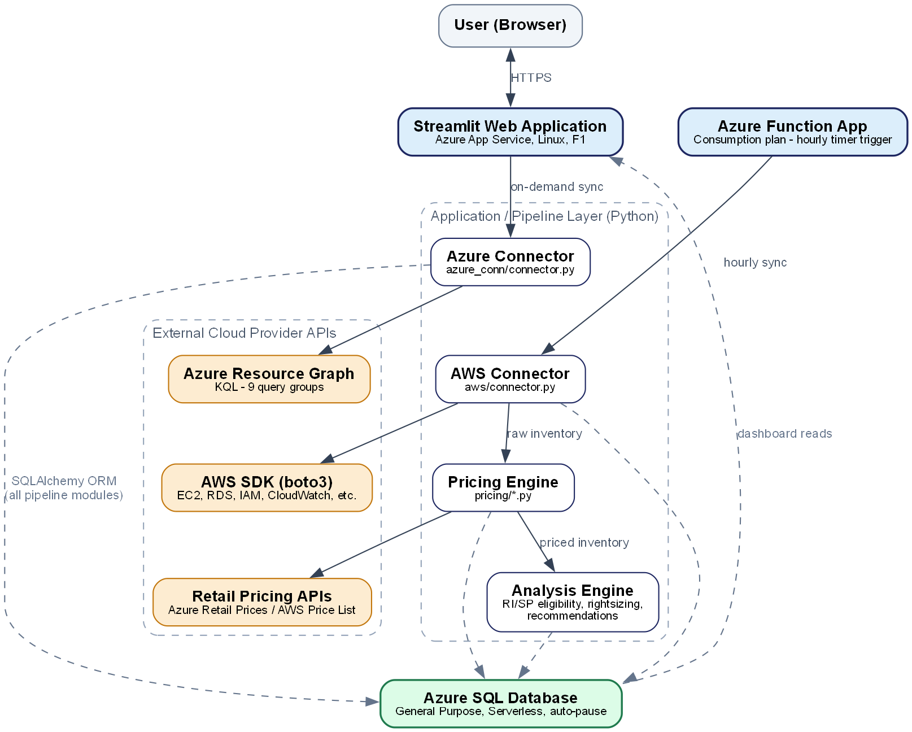

# Multi-Cloud FinOps Optimization System

[](LICENSE)
[](https://www.python.org/downloads/)
[](#deploy)

A live, multi-tenant cost and inventory dashboard for organizations running on **both Azure and AWS**. It ingests real inventory and pricing from each provider's own APIs, reconciles it against owned Reserved Instances / Savings Plans, and surfaces rightsizing, coverage, and FinOps maturity — from one place, without either provider's native console.



Full component, data-flow, and schema diagrams: [PROJECT_ARCHITECTURE.md](PROJECT_ARCHITECTURE.md)

## Features

- Live ingestion — Azure Resource Graph (9 KQL query groups) + AWS across 14+ resource types, every region
- Real retail pricing enrichment, not a static table
- Reserved Instance / Savings Plan coverage, with correct per-provider scope matching
- VM / EC2 rightsizing from live Azure Monitor / CloudWatch metrics
- Recommendations engine with quantified monthly dollar impact
- FinOps Maturity Assessment (Crawl/Walk/Run) against real FinOps Foundation KPIs
- Passwordless DB auth (Managed Identity) — no secret ever stored
- Automated hourly sync via Azure Function, independent of the web app

## Deploy

Requires an Azure subscription (a free/student one works — every default SKU is free-tier eligible). Pick one:

| | Where | Command |
|---|---|---|
| **A** | [Azure Cloud Shell](https://shell.azure.com) — zero local install | `./azure_deploy/deploy_all_resources_cloudshell.ps1` |
| **B** | Your own machine (Windows/macOS/Linux) | `az login` then `./azure_deploy/deploy_all_resources.ps1` |
| **C** | Code-only redeploy (infra already exists) | `./azure_deploy/deploy_app_only.ps1` |
| **D** | GitHub Actions | auto-deploys on push to `main`, see [workflow](.github/workflows/deploy.yml) |

```bash
git clone https://github.com/akcloudx/Multi-Cloud-FinOps-Optimization-System.git
cd Multi-Cloud-FinOps-Optimization-System/azure_deploy
./deploy_all_resources_cloudshell.ps1   # Option A — prompts once for a SQL admin password, then fully automated
```

If the repo is private, clone with `gh repo clone akcloudx/Multi-Cloud-FinOps-Optimization-System` instead (`gh auth login` first).

**Full setup guide** (prerequisites, all four options in detail, parameters, cost breakdown, troubleshooting): [`docs/DEPLOYMENT.md`](docs/DEPLOYMENT.md)

## Tech Stack

Python 3.12 · Streamlit · SQLAlchemy (`mssql-python` passwordless dialect) · Azure SQL (Serverless) · `boto3` · `azure-identity`/`azure-mgmt-*` · Azure App Service + Function App (Linux)

## Local Development

```bash
python -m venv venv && ./venv/bin/pip install -r requirements.txt   # Windows: venv\Scripts\pip
streamlit run app.py
```

Sign in with **Demo Mode** — no cloud credentials needed.

## Security

- No standing credentials anywhere — both compute resources use Managed Identity; tenant secrets are encrypted at rest
- Read-only by design — Azure `Reader` role / minimal AWS IAM policy, verified against each provider's own policy simulator
- Git history audited with [gitleaks](https://github.com/gitleaks/gitleaks) + [betterleaks](https://github.com/betterleaks/betterleaks) — no live secrets

Found a security issue? Please open a private security advisory rather than a public issue.

## Contributing

Issues and PRs welcome — for anything non-trivial, open an issue first to discuss.

## License

MIT — see [LICENSE](LICENSE).

---

Built as a Capstone project for the M.Sc. in Cloud Architecture & Security (RACE, REVA University). Portions of this project were developed with AI assistance (Claude, Anthropic) under the author's direction and review.
